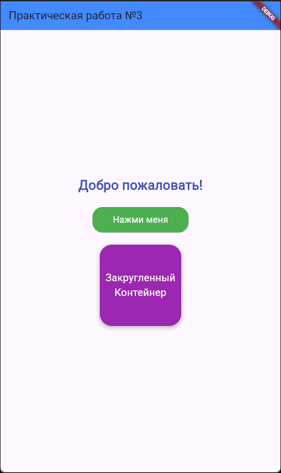
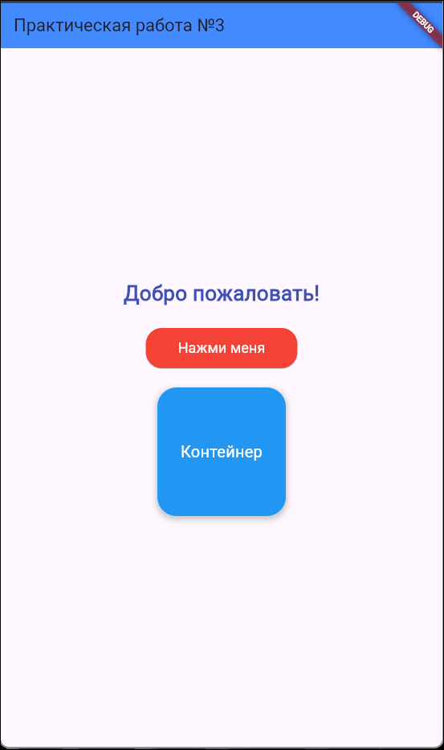

# Практическое занятие №3 Работа с компонентами пользовательского интерфейса. Работа с основными виджетами. Работа с цветами, шрифтами и компоновкой элементов».

## ЭФБО-09-23 Дроздов Иван

---

В приложении использовались виджеты Scaffold, Center, Column, Text, ElevatedButton и Container. Text стилизован с помощью размера шрифта, жирности и цвета. Кнопка оформлена с скруглёнными углами, цветом фона и текста, внутренними отступами. Контейнер имеет заданные размеры, цвет фона и центрированный текст.

1. Скриншот работающего приложения с текстом, кнопкой и контейнером.

2. Скриншот с изменёнными цветами и стилями текста.

