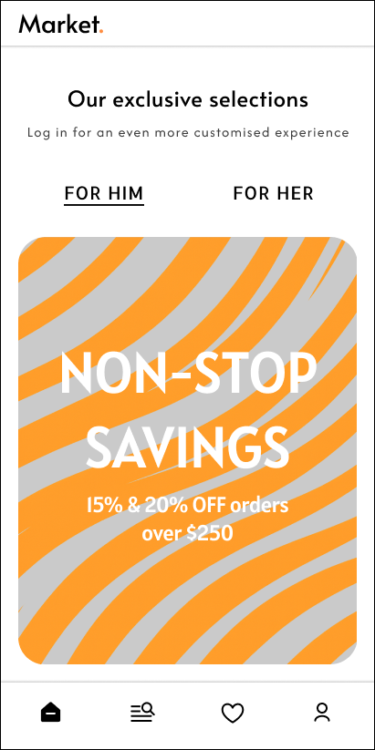
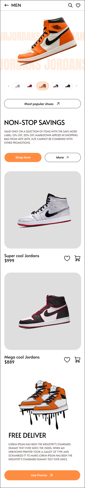
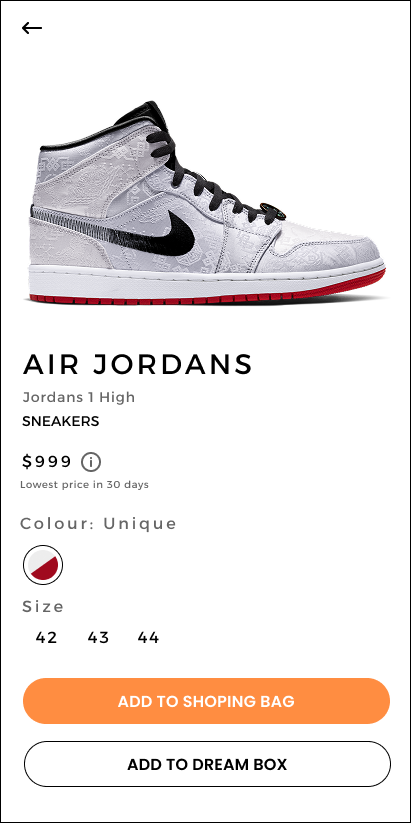
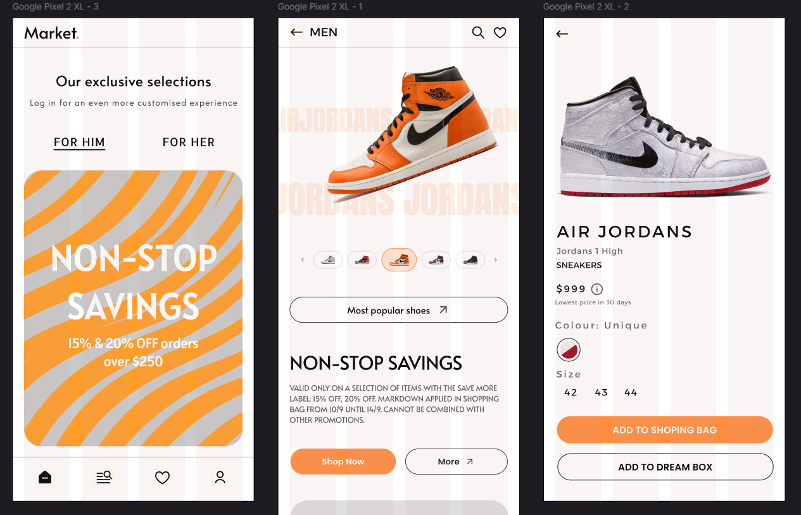
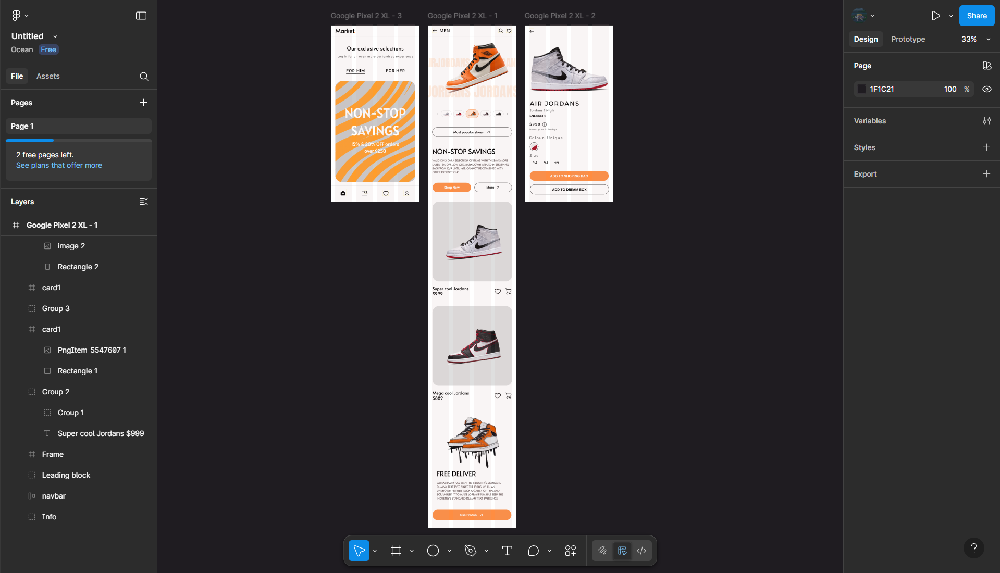
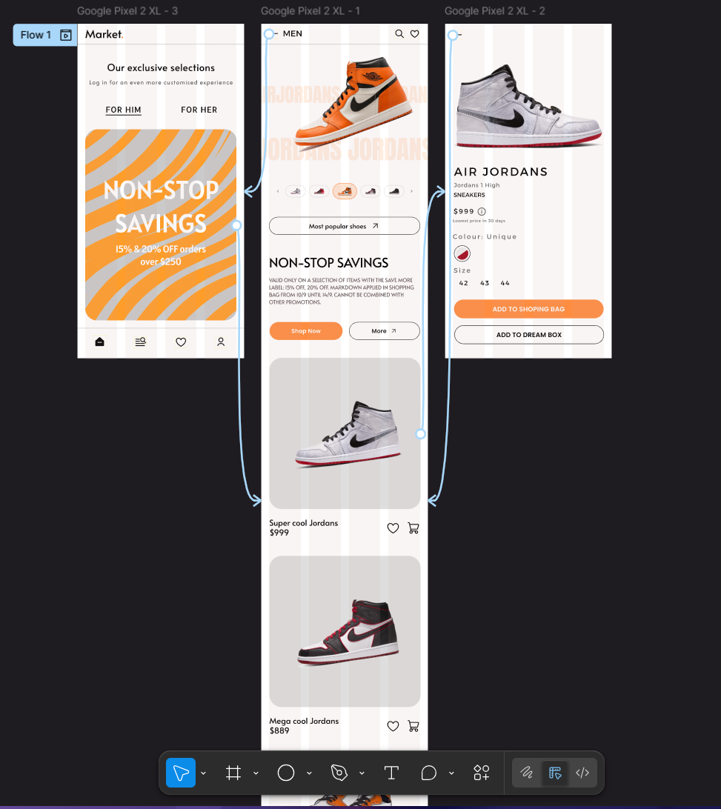
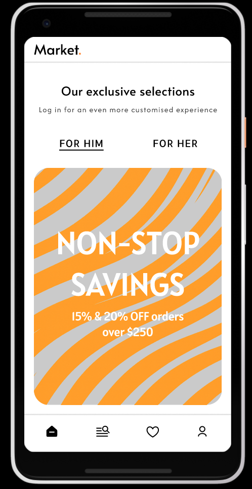
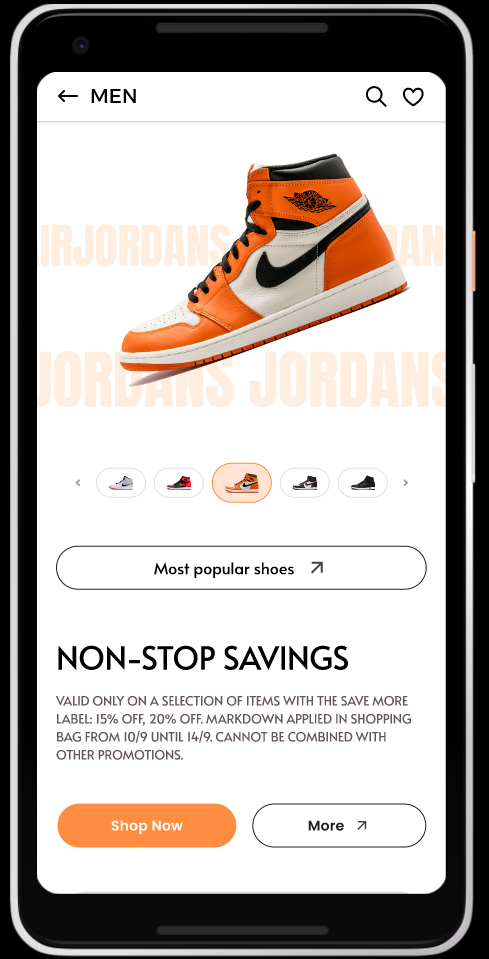
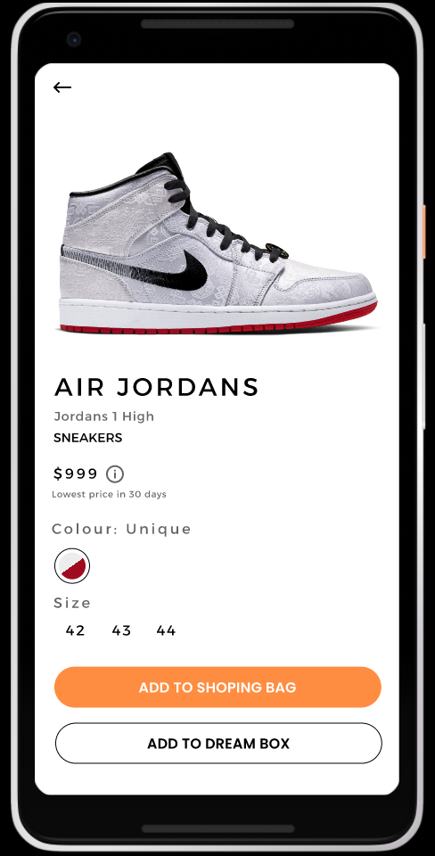

# **Введение** 🤓

В процессе практической работы был разработан дизайн мобильного приложения - магазина кроссовок. В результате работы созданы 3 функциональных экрана (главная страница, каталог товаров, карточка товаров), которые включают следующие элементы:

- Headers
- Footers
- Navbars
- Buttons
- Other components
# **Основные этапы разработки** 🗺️

## **1. Главный экран (Home page)**

> [!NOTE]
> При нажатии на главный баннер мы можем перейти на экран каталога товаров, представленных к продаже со скидкой

## **2. Каталог товаров**

> [!NOTE]
> Каталог товаров имеет два кликабельных элемента:
> - **Стрелка "назад"** в хэдере, при нажатии на которую можно вернуться на главный экран
> - **Карточка товара**, при нажатии на которую можно перейти на расширенную карточку в отдельном экране

## **3. Расширенная карточка товара**

> [!NOTE]
> При нажатии на стрелку "назад" в хэдере можно вернуться на экран с каталогом товаров
## **4. Общий вид всех основных экранов**

### Вид всех экранов в режиме Design

### Вид всех экранов в режиме Prototype

### Вид всех экранов в режиме Present

