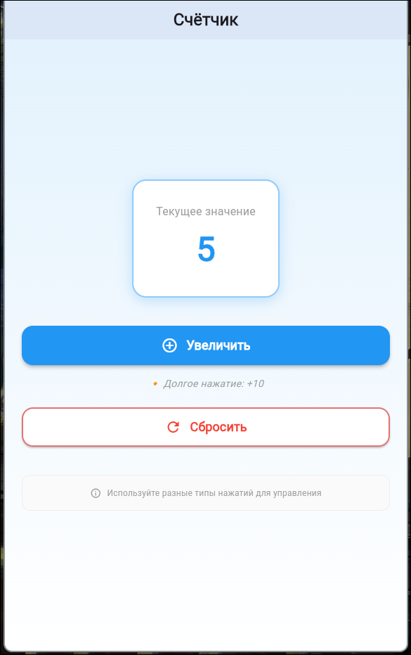
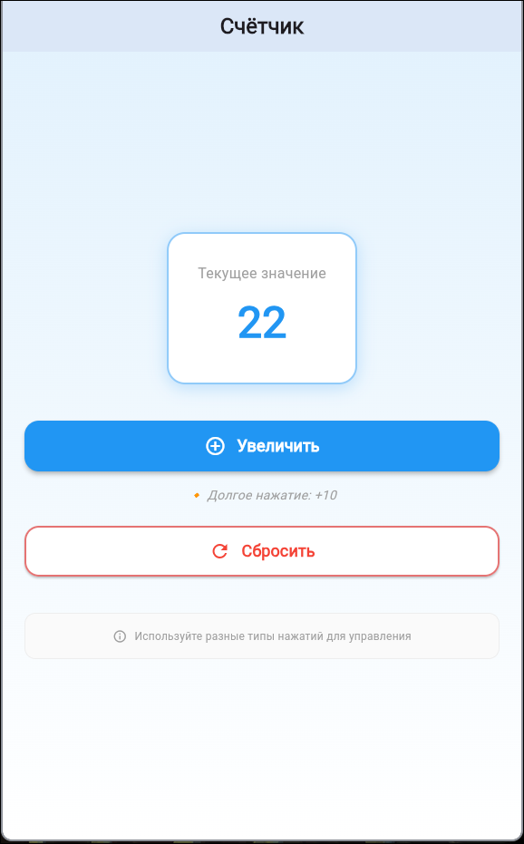
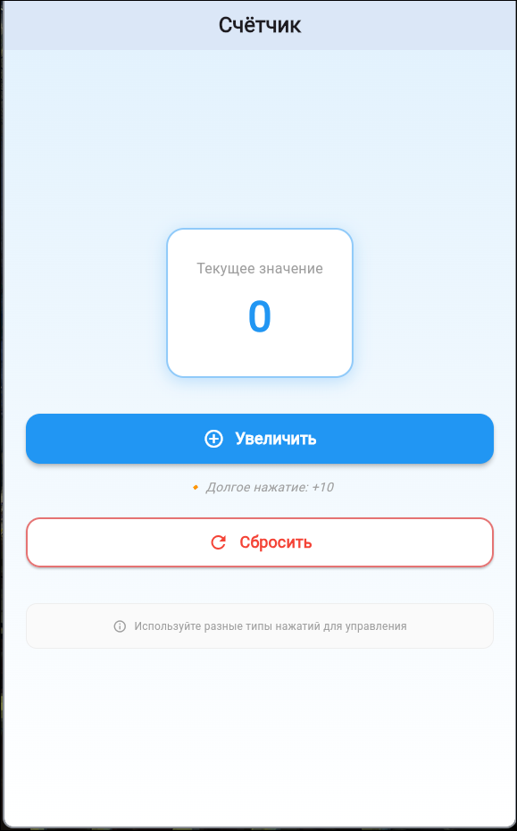

# Практическое занятие №4 Способы компоновки элементов и контейнеры. Обработка событий. Управление состоянием. Обновление состояния виджетов при нажатии кнопок или других событиях.

## ЭФБО-09-23 Дроздов Иван

---

В приложении использовались виджеты Scaffold, Center, Column, Text, ElevatedButton и Container. Text стилизован с помощью размера шрифта, жирности и цвета. Кнопка оформлена с скруглёнными углами, цветом фона и текста, внутренними отступами. Контейнер имеет заданные размеры, цвет фона и центрированный текст.

1. Скриншот работающего приложения с кнопками и счётчиком.



2.	Скриншот при значении счётчика > 10.



3.	Скриншот после сброса.



---

## Структура приложения

Приложение построено на основе следующих виджетов:

- **MaterialApp** – корневой компонент приложения
- **Scaffold** – обеспечивает базовую структуру экрана с AppBar и областью контента
- **AppBar** – верхняя панель с заголовком "Практика №4"
- **Center** – центрирует содержимое на экране
- **Column** – располагает элементы интерфейса вертикально
- **Text** – отображает текущее значение счётчика
- **Container** – используется для стилизации кнопок (фон, скругления)
- **TextButton** – интерактивные кнопки "Увеличить" и "Сбросить"
- **Padding** и **SizedBox** – обеспечивают отступы между элементами

## Управление состоянием

Для работы с изменяемым состоянием реализован **StatefulWidget** (`CounterScreen`). Логика состояния включает:

- Объявление переменной-счётчика:
  ```dart
  int _counter = 0;
  ```

- Обновление интерфейса через метод **setState()**, который перерисовывает экран при изменении значения:

  ```dart
  setState(() {
    _counter++;
  });
  ```

  ```dart
  setState(() {
    _counter = 0;
  });
  ```

  ```dart
  setState(() {
    _counter += 10;
  });
  ```

## Обработка пользовательских действий

Реализованы различные типы взаимодействий:

1. **Короткое нажатие** на кнопку "Увеличить" – прибавляет 1 к счётчику
2. **Долгое нажатие** на кнопку "Увеличить" – увеличивает значение сразу на 10
3. **Нажатие** на кнопку "Сбросить" – обнуляет текущее значение счётчика